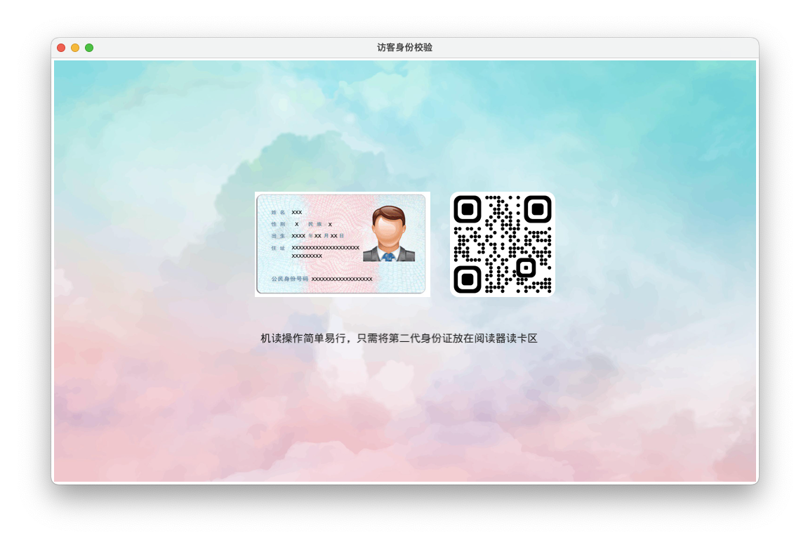

> [中文](README_zh.md) English

# Fyne Builder

Fyne GUI builder which converts an XML UI into a Fyne UI object. Seperating the UI from its logic will simplify coding and modification, and will enable hot reloading.


### Demo UI XML

```xml
<?xml version="1.0" encoding="UTF-8"?>
<Max>
    <Image id="bg" width="1000" height="600" src="embed:background.jpg" />
    <Center>
        <VBox>
            <HBox>
                <Image id="id" width="250" height="150" src="embed:idcard.jpg" />
                <Label> </Label>
                <Image id="qr" width="150" height="150" src="embed:qrcode.png" />
            </HBox>
            <Label> </Label>
            <Text id="description" color="black">机读操作简单易行，只需将第二代身份证放在阅读器读卡区</Text>
        </VBox>
    </Center>
</Max>
```

### Go code to load XML

```go
func main() {
	a := app.New()
	a.Settings().SetTheme(&theme.UnicodeTheme{})

	var res = fynebuilder.ResourceDict{
		"icon.png":       fyne.NewStaticResource("icon.png", icon),
		"idcard.jpg":     fyne.NewStaticResource("idcard.jpg", idcard),
		"background.jpg": fyne.NewStaticResource("background.jpg", background),
		"qrcode.png":     fyne.NewStaticResource("qrcode.png", qrcode),
	}

	a.SetIcon(res["icon.png"])

	//      窗口
	w := a.NewWindow("访客身份校验")

	watcher := fynebuilder.NewWatcher("demo.ui", res, func(objs fynebuilder.ObjectDict) {
		w.SetContent(objs.GetTop())
	})
	defer watcher.Close()

	w.ShowAndRun()
}
```

### Generated UI

