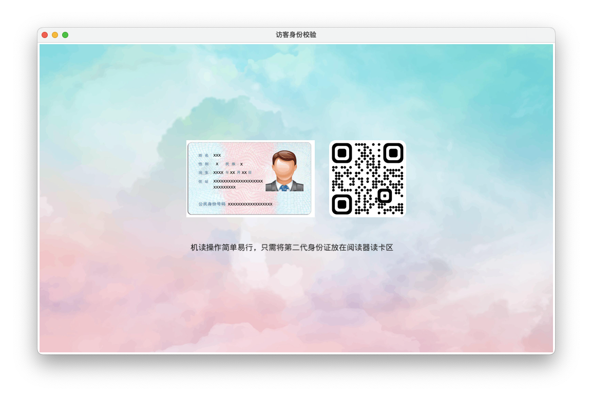

> [中文](README_zh.md) English

# Fyne Builder

Fyne GUI builder which converts an XML UI into a Fyne UI object. Seperating the UI from its logic will simplify coding and modification, and will enable hot reloading.


### Demo UI XML

```xml
<?xml version="1.0" encoding="UTF-8"?>
<Max>
    <Image id="bg" width="1000" height="600" src="embed:background.jpg" />
    <Center>
        <VBox>
            <HBox>
                <Image id="id" width="250" height="150" src="embed:idcard.jpg" />
                <Label> </Label>
                <Image id="qr" width="150" height="150" src="embed:qrcode.png" />
            </HBox>
            <Label> </Label>
            <Label id="description" color="black">机读操作简单易行，只需将第二代身份证放在阅读器读卡区</Label>
        </VBox>
    </Center>
</Max>
```

### Go code to load XML

```go
func main() {
	a := app.New()
	a.Settings().SetTheme(&theme.UnicodeTheme{})
	a.SetIcon(resourceIcon)
	//      窗口
	w := a.NewWindow("访客身份校验")

	var embedResourcesDict = map[string]*fyne.StaticResource{
		"idcard.jpg":     resourceJpegIdCard,
		"background.jpg": resourceJpegBackground,
		"qrcode.png":     resourcePngQRcode,
	}

	c := fynebuilder.Load("demo.ui", embedResourcesDict)
	w.SetContent(c)

	watcher := monitor("demo.ui", func() {
		t := time.Now()
		c := fynebuilder.Load("demo.ui", embedResourcesDict)
		w.SetContent(c)
		log.Printf("Reloaded %q in %v.", "demo.ui", time.Since(t))
	})

	w.ShowAndRun()
	watcher.Close()
}
```

### Generated UI

